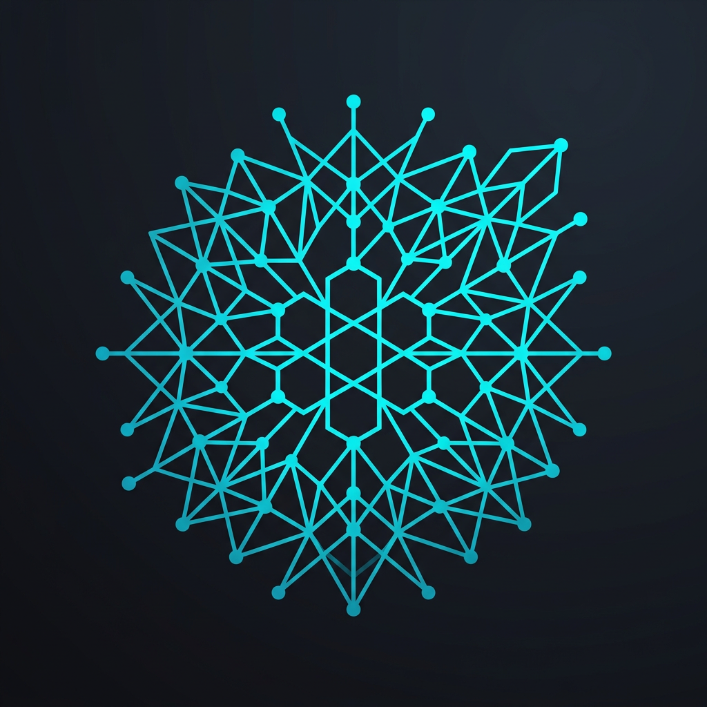
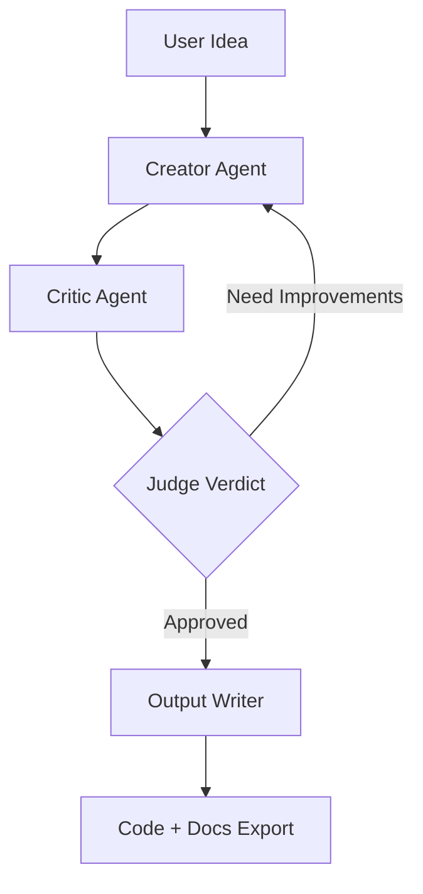

<p align="center">
  
</p>

# Entropy Dev Engine

> **Architecture emerges from entropy.**

Entropy Dev Engine is a multi-agent AI system designed to transform raw software ideas into refined, production-ready architectures through automated dialectic debate.

---

## 🚀 The Concept

Inspired by Information Theory and conceptualized for the AI era, this engine uses a specialized multi-agent workflow to solve the "blank page" problem in software engineering.

## 🤖 The Agents

At the core of the engine are three specialized agents that collaborate in a high-stakes debate:

- **Creator** → Designs the initial architecture and generates the preliminary codebase.
- **Critic** → Aggressively reviews the output, hunting for security vulnerabilities, performance bottlenecks, and scalability issues.
- **Judge** → Mediates the debate, analyzes the history, and decides when the architecture has reached the necessary stability for export.

## 🛠️ Quick Start

```bash
# Run the engine with a raw idea
entropia run "build a decentralized mesh network for localized emergency communication"
```

### Example Output

```bash
Round 1/5 – Creator generating architecture...
Round 1/5 – Critic reviewing architecture...

⚠️ Security issues detected:
- Missing peer authentication
- Potential for sybil attacks

Round 2/5 – Creator applying architectural hardening...
✅ FINAL STATUS: STABLE
📦 Exporting project to ./entropia_out/2026-03-09/
```

## 🏗️ Architecture Flow



## 📜 Tags

`#ai` `#multi-agent` `#llm` `#software-architecture` `#automation` `#developer-tools` `#autogen` `#langgraph`

---
Made with ☕ and AI by [DouglasScarello](https://github.com/DouglasScarello)
